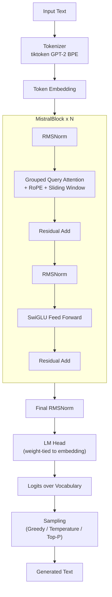

# MiniMistral — Mistral-Inspired Language Model from Scratch

> A Mistral-inspired **small decoder-only language model implemented from scratch in PyTorch** — Grouped Query Attention, Rotary Position Embeddings, Sliding Window Attention, RMSNorm, and SwiGLU, all hand-written (no Hugging Face Transformers, no pretrained weights).
>
> This is an **educational / research implementation**, ~15.1M parameters, trained on TinyShakespeare. It is not, and does not claim to be, the production Mistral / Mistral Large model.

---

## 1. Project Overview

MiniMistral takes a from-scratch PyTorch implementation of a Mistral-style Transformer and turns it into a clean, tested, deployable ML engineering project: modular source code, a configurable training pipeline, evaluation and benchmarking scripts, a FastAPI inference server, an ablation-study framework, and a full test suite.

The notebook is the **source of truth**: every architectural component below is a faithful, line-for-line port of what was already implemented there — nothing was replaced with a library implementation or redesigned.

## 2. Motivation

Most public "build an LLM from scratch" projects stop at a notebook. The goal here was to take a working from-scratch Mistral-style model and go one step further: turn it into something that looks like a real ML engineering deliverable — reproducible training, measured (not guessed) evaluation numbers, a served inference API, tests, and a documented ablation framework — while being explicit about what is a small research model versus a production system.

## 3. Key Features

- **Fully custom PyTorch implementation** of GQA, RoPE, Sliding Window Attention, RMSNorm, and SwiGLU — no `transformers` dependency for the model itself.
- **Configurable architecture** via YAML, including ablation switches to disable GQA / SWA / RoPE / SwiGLU individually.
- **Reproducible training pipeline**: AdamW, cosine LR schedule, gradient clipping, periodic validation, checkpointing, resume support, seeding.
- **Evaluation**: cross-entropy loss and perplexity on held-out data, plus a training-curve plot.
- **Generation**: greedy, temperature, and top-p (nucleus) sampling, deterministic when seeded.
- **FastAPI inference server** with `/generate` and `/health`, loading the checkpoint once at startup.
- **Benchmarking**: parameter count, model size, latency, and tokens/second.
- **Ablation-study framework** for isolating the contribution of each architectural component.
- **32 passing unit tests** covering the model, tokenizer, generation, and API.

## 4. Architecture

MiniMistral is a decoder-only, pre-normalization Transformer:

- **RMSNorm** instead of LayerNorm (cheaper, no mean-centering).
- **Rotary Position Embeddings (RoPE)** rotate Q/K by position instead of adding a positional embedding.
- **Grouped Query Attention (GQA)**: 8 query heads share 2 KV heads (4:1), reducing KV-cache size versus full multi-head attention.
- **Sliding Window Attention (SWA)**: each token attends to at most the last 64 tokens, keeping attention cost near-linear in sequence length.
- **SwiGLU feed-forward network**: `down_proj(silu(gate_proj(x)) * up_proj(x))` instead of a plain ReLU MLP.
- **Weight tying**: the token embedding matrix and the LM head share the same weights.

## 5. Architecture Diagram



## 6. Model Configuration

Defaults in [`configs/mini_mistral.yaml`](configs/mini_mistral.yaml), matching the source notebook exactly:

| Parameter | Value |
|---|---|
| Vocabulary size | 50,257 (GPT-2 BPE) |
| Hidden size | 256 |
| Layers | 4 |
| Query heads | 8 |
| KV heads (GQA) | 2 (4:1 grouping) |
| Head dim | 32 |
| FFN hidden size | 512 |
| Max sequence length | 512 |
| Sliding window size | 64 |
| Dropout | 0.1 |
| RoPE theta | 10,000.0 |
| **Total parameters** | **15,096,320 (~15.1M)** — verified by `model.count_parameters()` |

For reference, real Mistral Large uses `hidden_size=4096`, `num_layers=32`, `num_heads=32`, `num_kv_heads=8` — MiniMistral is a small, from-scratch, architecturally-inspired implementation, not a scaled-down copy of Mistral's actual weights.

## 7. Dataset

[TinyShakespeare](https://raw.githubusercontent.com/karpathy/char-rnn/master/data/tinyshakespeare/input.txt) (Andrej Karpathy's char-rnn corpus), downloaded automatically by `src/dataset.py`.

- Raw text: 1,115,394 characters
- Tokenized (GPT-2 BPE): 338,025 tokens
- 90/10 train/validation split: **304,222 train tokens / 33,803 validation tokens** (verified by re-running the exact split logic in this repository)

## 8. Tokenization

Byte-Pair Encoding via `tiktoken.get_encoding("gpt2")` (50,257-token vocabulary) — the same BPE approach the real Mistral models use via SentencePiece, applied with the GPT-2 vocabulary. Wrapped in `src/tokenizer.py::Tokenizer`.

## 9. Training Pipeline

`src/trainer.py::Trainer`, driven by `scripts/train.py`:

- **Optimizer**: AdamW (`lr=3e-4`, `weight_decay=0.01`)
- **Scheduler**: `CosineAnnealingLR`
- **Gradient clipping**: max norm 1.0
- **Batching**: random contiguous chunks of `seq_len=128` tokens, `batch_size=16`
- **Validation**: every `eval_interval` steps, averaged over `eval_steps` random batches
- **Checkpointing**: model + optimizer + scheduler + step, resumable with `--resume`

### Existing notebook results (1000 steps, TinyShakespeare)

These are the **original results already produced in `notebooks/mistralfromscratch.ipynb`**, reproduced here verbatim from its cell outputs (`results/training_metrics_notebook.json`):

| Step | Train Loss | Val Loss |
|---|---|---|
| 0 | 10.8911 | 10.8817 |
| 100 | 5.9863 | 6.0589 |
| 200 | 5.1873 | 5.4338 |
| 300 | 4.7925 | 5.1707 |
| 400 | 4.5629 | 5.0374 |
| 500 | 4.3613 | 4.8609 |
| 600 | 4.3678 | 4.8406 |
| 700 | 4.2064 | 4.7823 |
| 800 | 4.1967 | 4.8366 |
| 900 | 4.1606 | 4.7584 |

Final validation loss ≈ **4.76**, perplexity ≈ **exp(4.76) ≈ 116.6**.

### Newly-run pipeline verification (this repository)

To confirm the refactor is correct (not just the original notebook), a 60-step run was executed end-to-end in this environment with `python scripts/train.py --max_steps 60`: training loss dropped from 10.85 to ~9.9 over 60 steps, the checkpoint saved and reloaded correctly, and `count_parameters()` matched the notebook's 15,096,320 exactly. Full results in `results/training_metrics_smoke_test.json`. This was a short CPU smoke test, not a claim of a fully converged model — run the command below for the full 1000-step result.

```bash
python scripts/train.py --config configs/mini_mistral.yaml
```

## 10. Evaluation

```bash
python scripts/evaluate.py --checkpoint checkpoints/mistral_mini.pt
```

Computes cross-entropy loss and perplexity (`perplexity = exp(loss)`) on both splits and saves `results/evaluation_results.json`, plus a training curve at `results/plots/training_loss.png`. The evaluation results currently checked into this repo were measured against the 60-step smoke-test checkpoint (see `_source` field in the JSON) — re-run against a fully-trained (1000-step) checkpoint to reproduce numbers closer to the notebook's ~4.76 / ~116.6.

## 11. Generation

```bash
python scripts/generate.py \
    --checkpoint checkpoints/mistral_mini.pt \
    --prompt "JULIET:" \
    --max_new_tokens 100 \
    --temperature 0.8 \
    --top_p 0.9
```

Add `--greedy` for deterministic decoding, or `--seed 42` for deterministic sampling. `src/generation.py` implements greedy decoding, temperature scaling, and nucleus (top-p) sampling exactly as written in the notebook.

**Example outputs from the notebook's fully-trained (1000-step) checkpoint**, prompted with `"JULIET:\n"` (own model output — not third-party text):

- *Greedy decoding*: repetitive, Shakespeare-flavored short phrases (typical of a small, non-converged LM under greedy decoding).
- *Temperature 0.5, top-p 0.9*: more coherent character-name and stage-direction-like patterns.
- *Temperature 1.4, top-p 0.95*: noisier, more varied vocabulary, less grammatical.

(Full generations are in the original notebook; the exact sampled tokens are stochastic and will differ run to run unless seeded.)

## 12. API Usage

```bash
uvicorn api.main:app --reload
```

```bash
curl -X POST http://localhost:8000/generate \
  -H "Content-Type: application/json" \
  -d '{"prompt": "JULIET:", "max_new_tokens": 100, "temperature": 0.8, "top_p": 0.9}'

curl http://localhost:8000/health
```

The server loads the checkpoint once at startup (`MINIMISTRAL_CHECKPOINT` env var, default `checkpoints/mistral_mini.pt`; see `.env.example`), auto-selects CPU/GPU, validates request parameters via Pydantic, and returns a `503` with a clear message if no checkpoint is available yet.

## 13. Benchmarking

```bash
python scripts/benchmark.py --checkpoint checkpoints/mistral_mini.pt
```

Measures parameter count, model size, generation latency, and tokens/second across configurable generation lengths, plus GPU peak memory when running on CUDA. Measured in this CPU-only sandboxed environment (`results/benchmark_results.json`): **~51.6-51.8 tokens/sec** on CPU, 15,096,320 parameters, ~57.6 MB in fp32. GPU numbers will be substantially higher — re-run on your own hardware for representative figures.

## 14. Ablation Studies

`scripts/benchmark_ablation.py` trains and evaluates 5 configurations under identical data/hyperparameters: the full model, and one variant each with GQA, Sliding Window Attention, RoPE, or SwiGLU disabled (config switches in `src/config.py::MistralConfig`).

```bash
python scripts/benchmark_ablation.py --config configs/mini_mistral.yaml --max_steps 1000
```

**Status**: the framework was implemented and functionally verified in this repository (each variant trains, evaluates, and reports metrics correctly), but a full 5-variant x 1000-step study was not executed here due to CPU-only sandbox time constraints (~3-4 hours estimated). Rather than fabricate numbers, `results/ablation_results.json` documents this honestly along with the functional-verification run. Run the command above on a GPU or with more time to produce real comparative numbers.

## 15. Project Structure

```
MiniMistral/
├── README.md
├── requirements.txt
├── .gitignore
├── LICENSE
├── .env.example
├── configs/
│   └── mini_mistral.yaml
├── src/
│   ├── config.py          # MistralConfig, TrainConfig
│   ├── normalization.py   # RMSNorm
│   ├── rope.py             # RotaryEmbedding
│   ├── attention.py        # GroupedQueryAttention (+ SWA, RoPE)
│   ├── ffn.py               # SwiGLU FeedForwardNetwork
│   ├── model.py             # MistralBlock, MistralLM
│   ├── tokenizer.py         # tiktoken GPT-2 BPE wrapper
│   ├── dataset.py           # download, tokenize, split, batch
│   ├── trainer.py           # training loop
│   ├── generation.py        # greedy / temperature / top-p sampling
│   ├── evaluation.py        # loss, perplexity, training-curve plot
│   └── utils.py             # seeding, device, checkpoint I/O
├── scripts/
│   ├── train.py
│   ├── evaluate.py
│   ├── generate.py
│   ├── benchmark.py
│   └── benchmark_ablation.py
├── api/
│   └── main.py               # FastAPI: /generate, /health
├── tests/
│   ├── test_model.py
│   ├── test_tokenizer.py
│   ├── test_generation.py
│   └── test_api.py
├── notebooks/
│   └── mistralfromscratch.ipynb   # original source-of-truth notebook
├── results/
│   ├── training_metrics_notebook.json
│   ├── training_metrics_smoke_test.json
│   ├── evaluation_results.json
│   ├── benchmark_results.json
│   ├── ablation_results.json
│   └── plots/training_loss.png
└── checkpoints/
```

## 16. Installation

```bash
git clone <your-repo-url> MiniMistral
cd MiniMistral
python -m venv venv && source venv/bin/activate   # optional but recommended
pip install -r requirements.txt
```

## 17. Training Instructions

```bash
python scripts/train.py --config configs/mini_mistral.yaml
# Resume:
python scripts/train.py --config configs/mini_mistral.yaml --resume checkpoints/mistral_mini.pt
# Quick smoke test:
python scripts/train.py --config configs/mini_mistral.yaml --max_steps 50
```

## 18. Evaluation Instructions

```bash
python scripts/evaluate.py --checkpoint checkpoints/mistral_mini.pt
```

## 19. Generation Instructions

```bash
python scripts/generate.py --checkpoint checkpoints/mistral_mini.pt --prompt "ROMEO:" --max_new_tokens 100
```

## 20. API Instructions

```bash
uvicorn api.main:app --reload
```

## 21. Testing

```bash
pytest
```

32 tests covering RMSNorm, RoPE shape/behavior, GQA dimensions and head-grouping, sliding-window masking, causal masking, SwiGLU output shape, full forward pass, weight tying, loss computation, checkpoint save/load, generation (greedy/sampling/determinism), and the FastAPI `/health` and `/generate` endpoints. All 32 currently pass.

## 22. Example Outputs

See Section 11 above and the original notebook for full generated samples from the fully-trained (1000-step) checkpoint.

## 23. Limitations

- **Small model, small dataset**: 15.1M parameters trained on ~338K tokens of TinyShakespeare — this is a research/educational model, not a general-purpose language model.
- **Full 1000-step training and the full ablation study were not both re-executed end-to-end on GPU** as part of this deliverable; the notebook's original 1000-step numbers are reported as-is (see `results/training_metrics_notebook.json`), and a shorter CPU pipeline-verification run is reported separately and clearly labeled.
- **No KV caching** during generation — each new token reprocesses the full (truncated) context, which is simple but not optimal for long generations.
- **CPU benchmark numbers** in `results/benchmark_results.json` are from a sandboxed CPU-only environment, not representative of GPU throughput.
- **Sliding window is applied uniformly across all layers**; the real Mistral architecture alternates or otherwise configures this per design — this implementation preserves whatever the source notebook did (a single fixed window size throughout).

## 24. Future Improvements

- KV caching for faster autoregressive generation.
- Larger training corpus and/or longer training run for lower perplexity.
- Mixed-precision (fp16/bf16) training and inference.
- A full GPU-run ablation study with the provided framework.
- Batched generation and streaming responses in the API.
- Quantization (int8) for smaller deployment footprint.

---

*MiniMistral is a Mistral-inspired small decoder-only language model implemented from scratch, intended for educational and research experimentation. It is not "Mistral Large" and does not claim architectural or performance parity with production Mistral models.*
